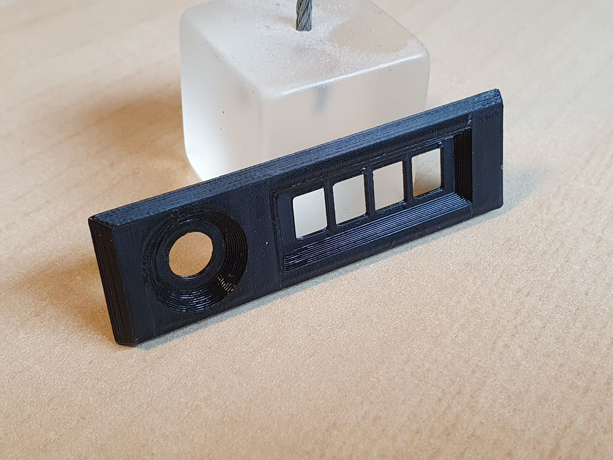
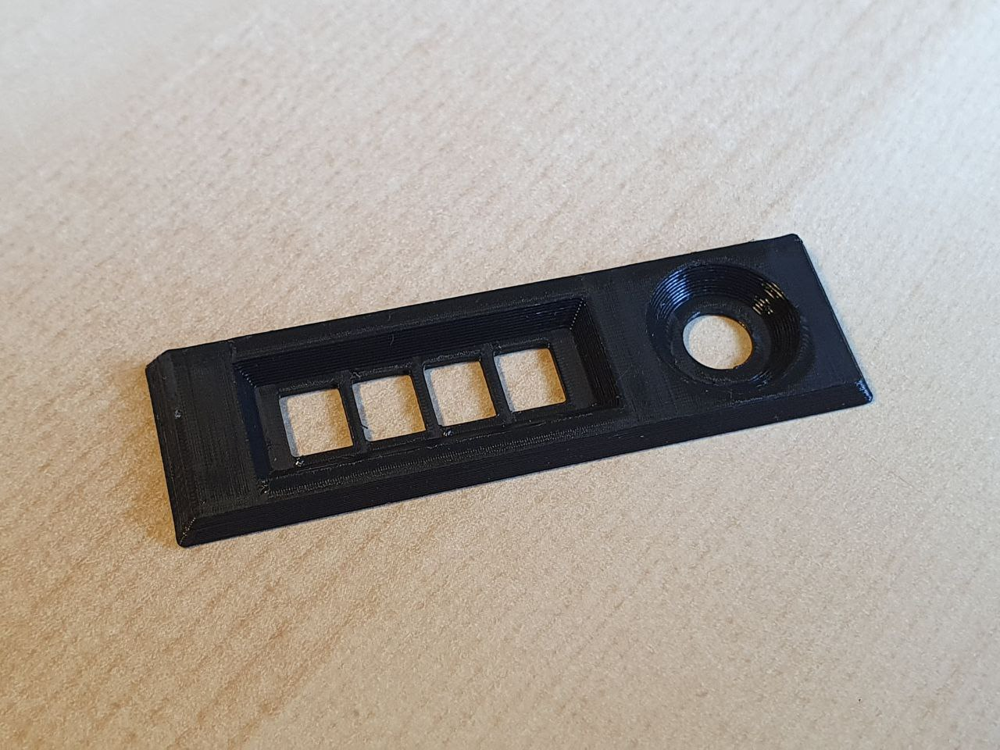
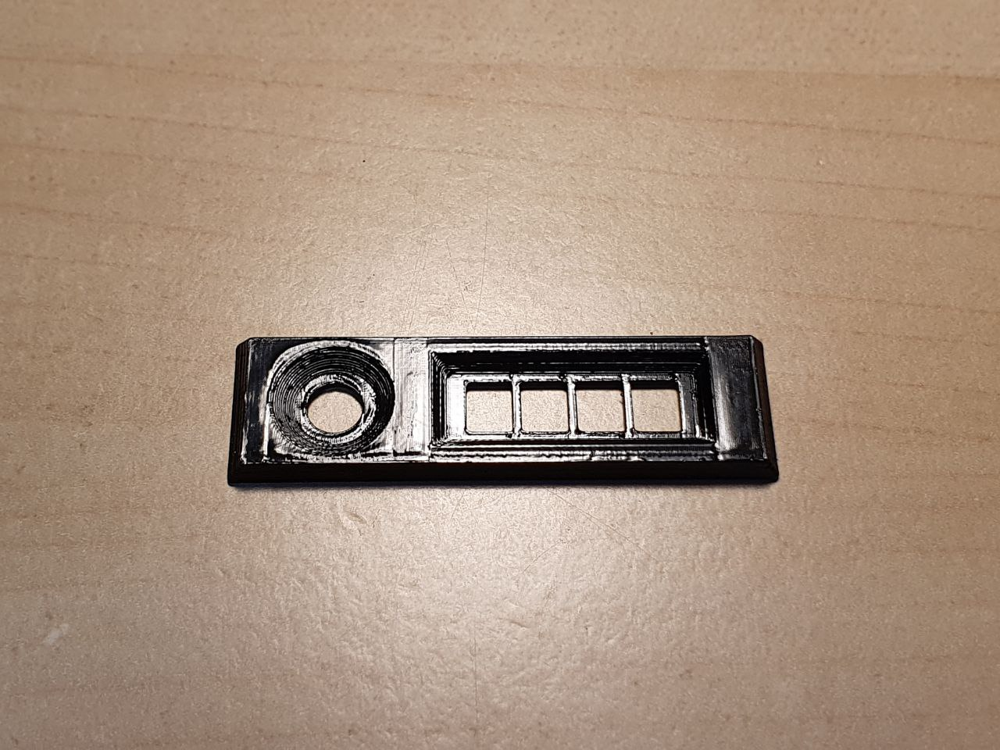
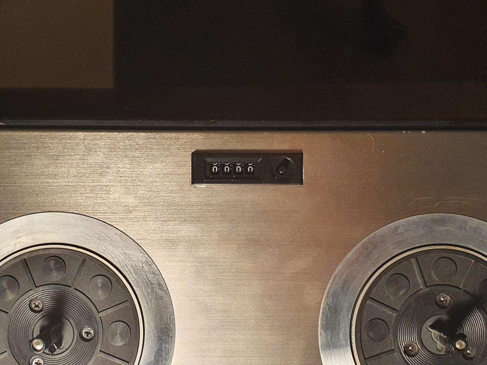
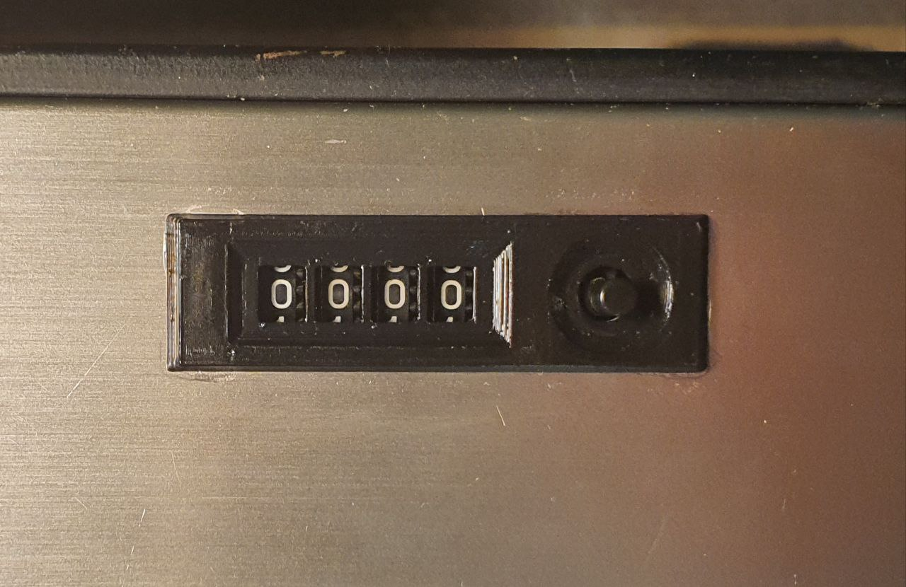
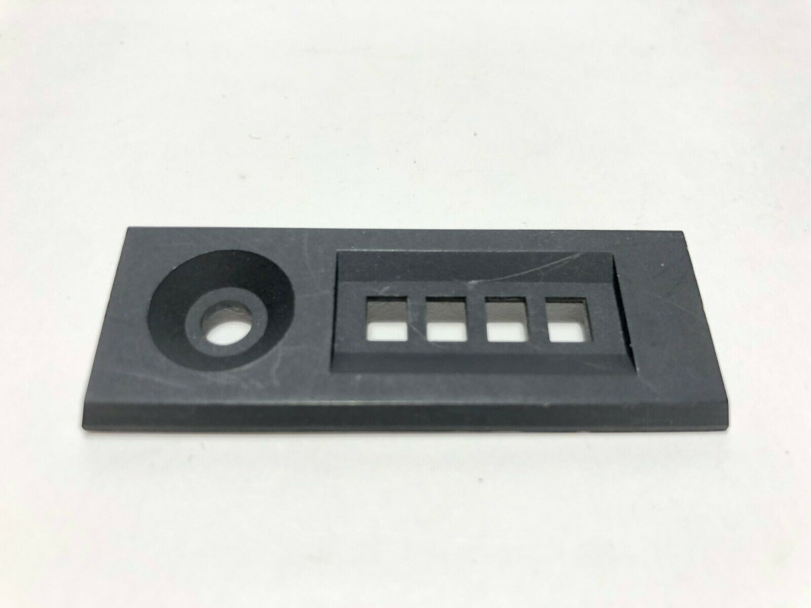
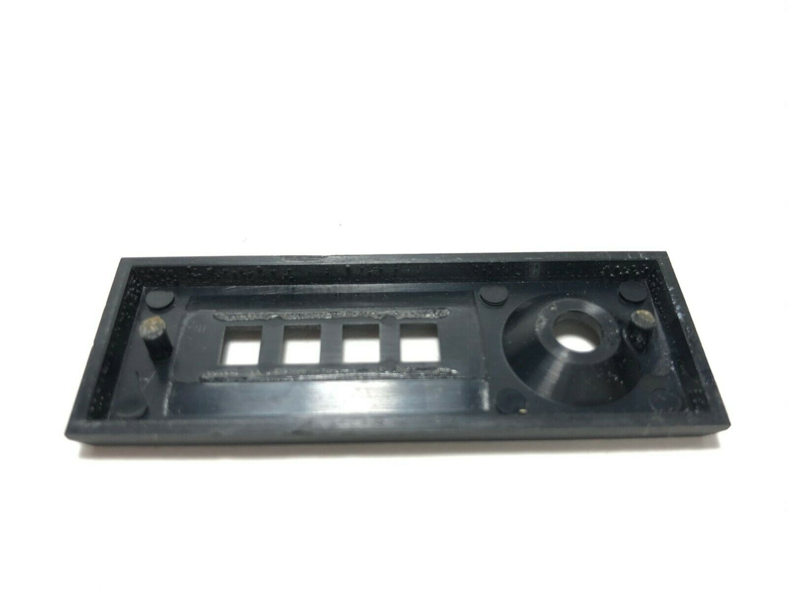
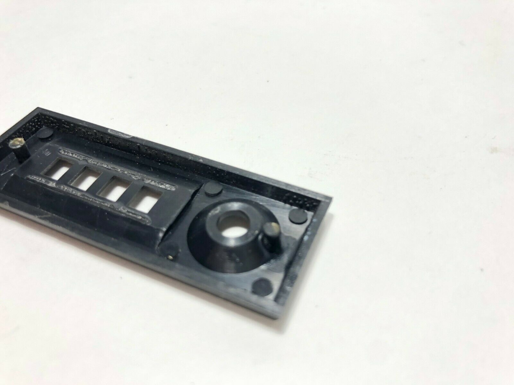

# counter_plate
Repair information for the Tape Counter Cover Plate of the Akai GX-260D Stereo Tape Deck (1973)

- gx260d_counter_plate.scad : the 3D schematic for the counter tape replacement.
- gx260d_counter_plate.stl : the STL file generated from the scad file.
- the pictures of the 3D print (printed by https://de.treatstock.com/c/d3d-printing-service): 
- 
- the 3D print after aceton vapor smoothing (I'm not sure if it made the part better): 
- the pictures of the 3D print mounted on the Tape Deck: 
- 
- the photos of the original tape counter cover (found on eBay) which I used to reverse engineer the 3D replacement : 
-  
-  