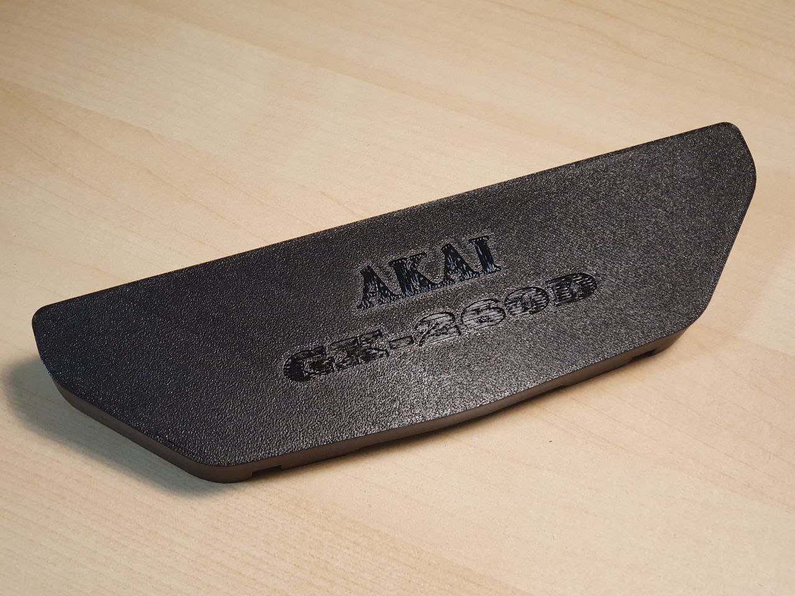
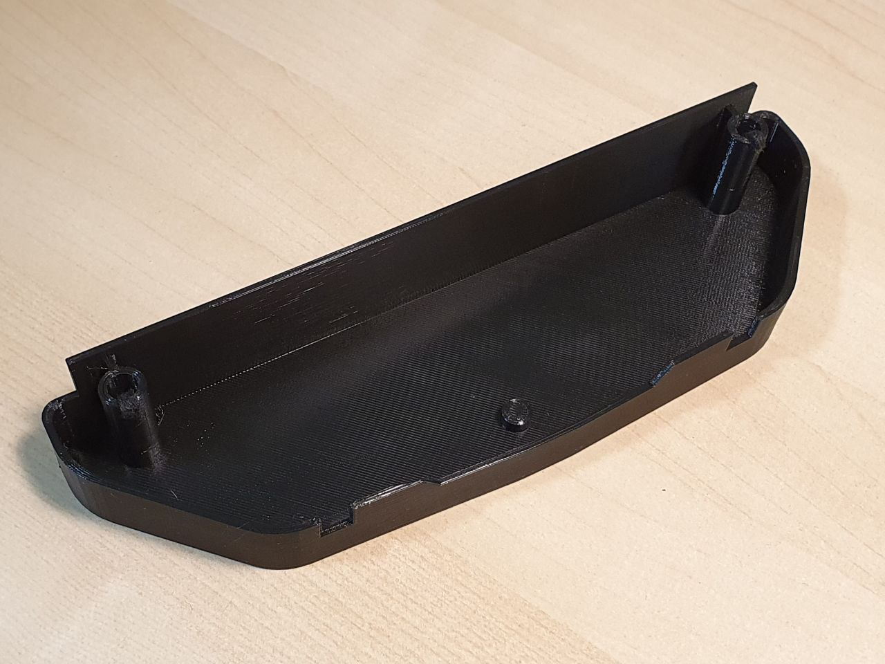
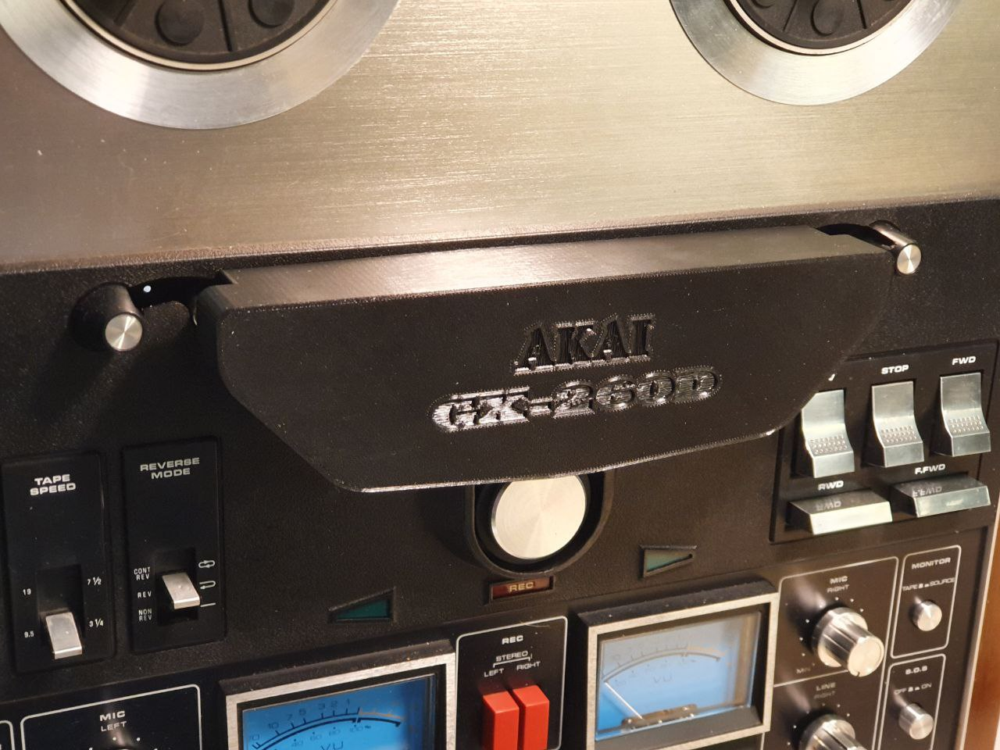
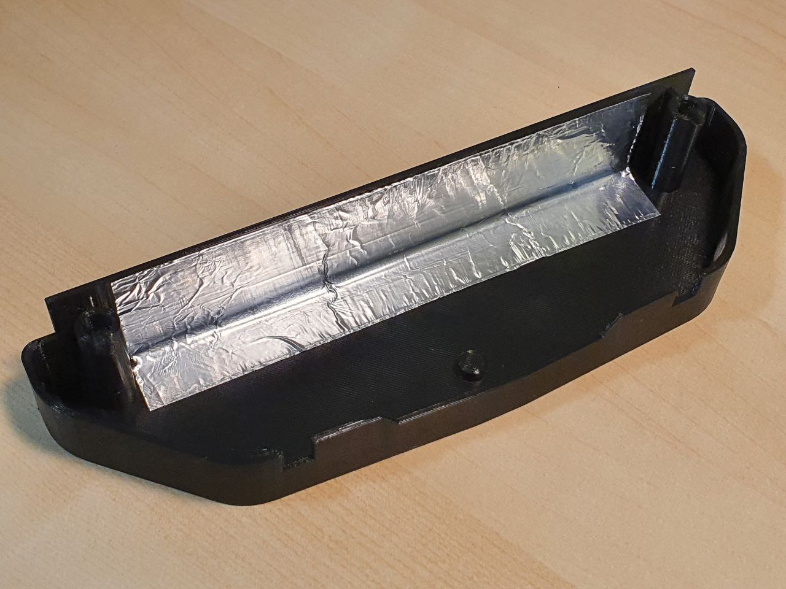
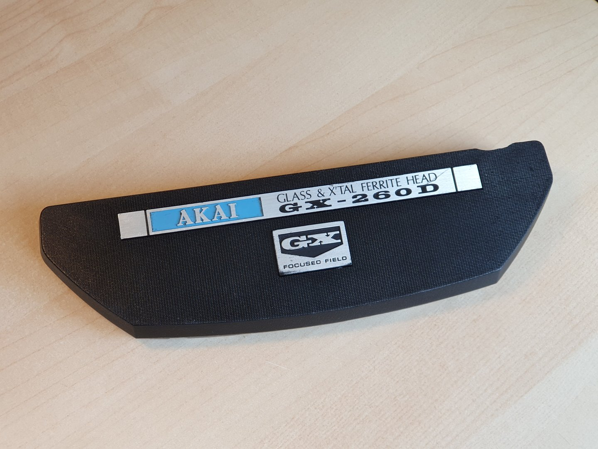
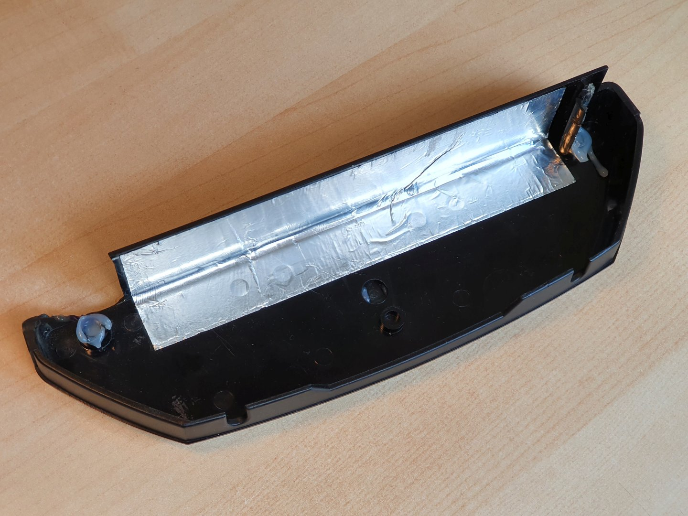
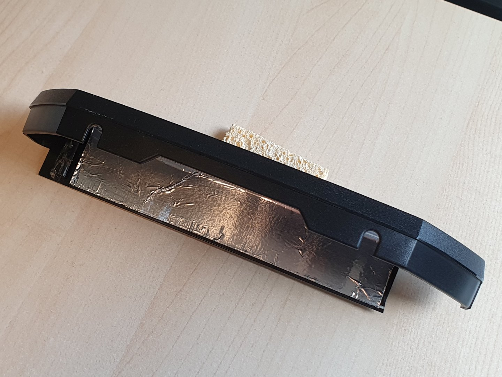
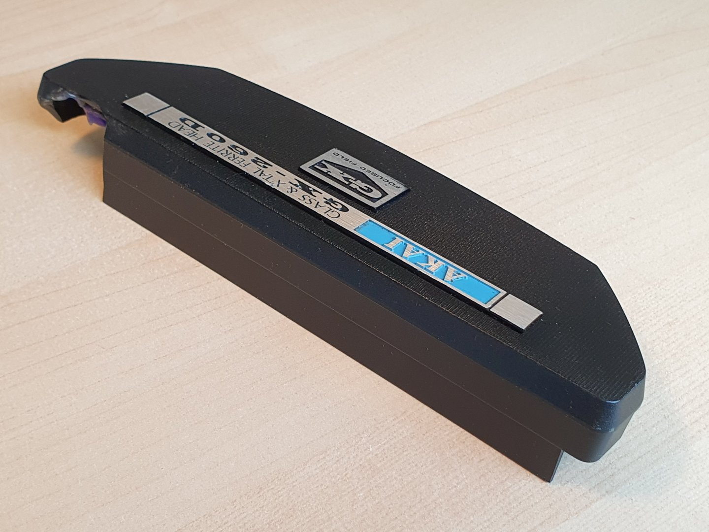

# head_cover
Repair information for the Head Cover of the Akai GX-260D Stereo Tape Deck (1973)

- gx260d_head_cover.scad : the 3D schematic for the head cover replacement. You will need to install the polyRound library from https://github.com/Irev-Dev/Round-Anything in your OpenSCAD to run it.
- gx260d_head_cover.stl : the STL file generated from the scad file
- akai.svg : the Akai logo vector graphic used in gx260d_head_cover.scad 
- gx260d.svg : the model designation vector graphic used in gx260d_head_cover.scad 
- the front picture of printed head cover :  
- the rear picture of the printed head cover : 
- the picture of the pirnted head cover mounted to the Akai GX-260D: 
- as there is no spring tightener like in the original (my broken cover has anyway missing it) I put a slimstrip of the self adhesive felt damper inside of the holder hole: .
- you need to stick a strip of self adhesive aluminium foil on the back side to prevent interferences :  : 
- the picutures of the original head cover (my broken one) : 
-  
-  
-  

